<h1 align=center>多用户日程管理系统<h1/>


[TOC]

## 一、程序功能介绍

该程序采用面向对象方法和 Java 语言开发一个基于命令行交互方式的议程(agenda)管理系统。 已注册到系统的用户(user)可添加(add)、删除(delete)、查询(query)系统中记录的会议(meeting)安排;系统还提供新用户注册(register)、清除(clear)某一用户所有会议安排等管理功能。

### 1. 功能介绍

- 用户注册 

    注册新用户时，应为该用户设置一个唯一的用户名以及一个密码。

    如果注册时提供的用户名已由其他用户使用，应反馈一个适当的出错信息;成功注册后，亦应反馈一个成功注册的信息。

- 添加会议 

    已注册的用户可以添加一个新会议到其议程安排中。规定会议仅允许在两个已注册的用户间举行，不可创建无另一已注册用户的会议。

    添加会议时提供的信息应包括:会议的起始时间(start time)和终止时间(end time)、描述本次会议的标签(label)、以及预约的另一用户名字(scheduled user)。成功添加会议后，它应既出现在发起该会议 的用户的议程中，也应出现在该会议所预约的另一用户的议程中。

    注意，用户不允许分身参加多个会议，即如果用户自己或被预约的用户已有一个会议安排与新会议在时 间上相互重叠(overlap)，该新会议将无法成功添加到议程管理系统中。

    用户在添加会议后，应获得适当的反馈信息，以得知是成功地添加了新会议，还是在添加过程出现了某些错误。

- 查询会议

    已注册的用户可以查询自己的议程中某一时间段(time interval)的所有会议安排。

    查询会议时提供的参数应包括所关注时间段的起始时间和终止时间;查询结果返回该用户议程中在指定 时间范围内找到的所有会议安排的列表，在列表中给出每一会议的起始时间、终止时间、标签、以及被预约的另一用户的名字。

    注意，查询会议的结果既应包括用户作为发起人的那些会议，也应包括用户作为被预约人的那些会议。

- 删除会议

    已注册的用户可以删除自己登记的某一会议安排。

    删除会议时，提供的参数除执行删除功能的用户的名字及其密码外，还包括一个能惟一地标识待删除的会议的参数(提示:可以简单地以会议标签作为一个会议的惟一标识)。

- 清除会议 

    已注册的用户可以清除自己创建的所有会议安排。

该程序使用Java多态、虚拟类接口完成以上功能。

### 2. 程序可输入指令

系统启动后，显示输入提示符“$”(称之为 prompt，类似 MS-DOS 的提示符“>”)，然后与终端用户以 命令行方式进行交互。设所有命令的名字是大小写无关的，但命令的参数却是大小写敏感的。约定系统支持的交互命令格式如下:

**$ register [userName] [password]**

该命令用于注册一个新用户。其中，参数 userName 是用户提供的注册名字，password 是用户自 己选择的密码。

**$ add [userName] [password] [other] [start] [end] [title]**

该命令用于添加一个新的会议安排。其中，参数 userName 是一个已注册的用户名字，password 是该用户的密码，other 是新添加会议所预约的另一已注册用户的名字，start 是会议的起始时间， end 是会议的终止时间，title 是新添加会议的标签。

**$ query [userName] [password] [start] [end]**

该命令用于查询某一用户在某一时间段内的会议安排。其中，参数 userName 是一个已注册的用 户名字，password 是该用户的密码，start 和 end 分别是查询时间段的起始时间和终止时间，该时 间段内查获的会议安排将被返回。

**$ delete [userName] [password] [meetingId]**

该命令用于删除某一用户的指定会议安排。其中，参数 userName 是一个已注册的用户名字， password 是该用户的密码，meetingId 指定将被从议程中删除的会议的标识。

**$ clear [userName] [password]**

该命令用于清除某一用户的所有会议安排。其中，参数 userName 是一个已注册的用户名字， password 是该用户的密码。

**$ batch [fileName]**

该命令用于批处理存储在文本文件 fileName 中的 register、add、query、delete、clear 等命令，其中每一条命令(包括其参数)单独占一行。该命令相当于 MD-DOS 中的脚本文件(即批命令文件.bat 或.cmd)。借助该命令，你可以方便地运行多个不同的测试用例。

**$ quit**

该命令用于退出议程管理系统。

## 二、设计思路

### 1.UML类图：

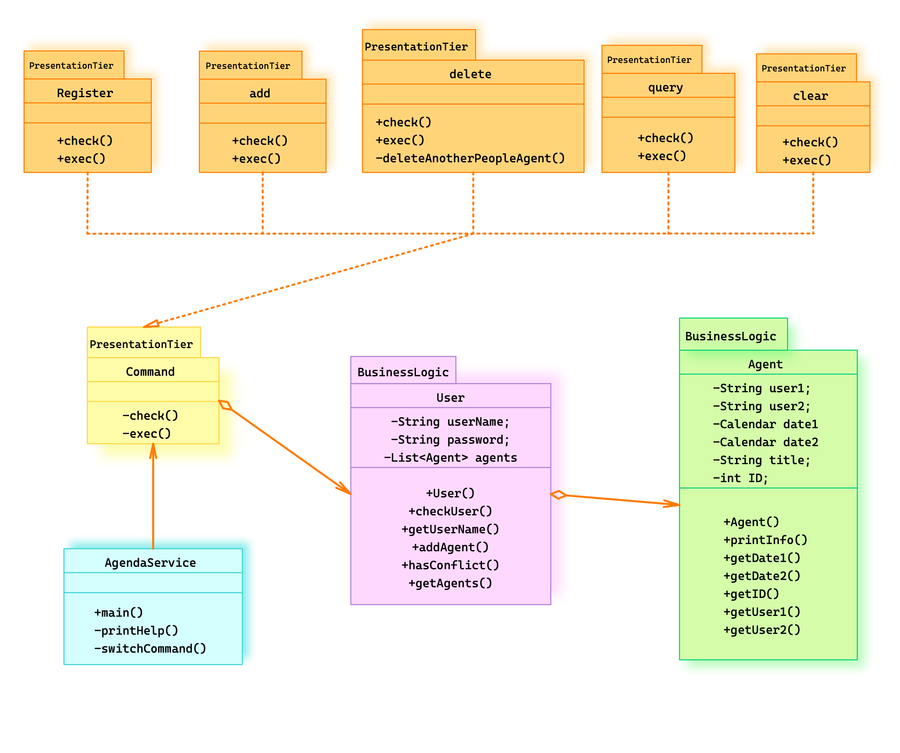

### 2. 设计思路描述

- `AgendaService.java`为主文件，展示开始界面，并读取用户输入，得到输入后便实例化一个`Command`对象
- `Command.java`为一个虚拟类接口，根据传入的命令不同被实例化为不同的对象
- 主函数会创建一个`Users`列表，`Command`对象在执行过程中会实例化`User`对象并插入到列表中，其中的每个`User`都含有一个`Agent`列表，存储着这个用户所有的日程
- 各方法的具体实现详见代码注释或`JavaDoc`文档

## 三、编译与运行

> 在某些操作系统中可能无法直接执行脚本文件，需要先输入以下命令：
>
> ```sh
> chmod +x build.sh
> chmod +x agenda.sh
> ```
> 

- 编译

    在主目录下通过终端运行：
    
    ```sh
    javac -sourcepath src -d bin src/*.java
    ```
    
    或直接运行脚本文件：
    
    ```shell
    ./build.sh
    ```

- 运行

    进入到`bin`目录中再运行，即执行以下命令：

    ```sh
    cd bin
    java AgendaService
    ```

    或直接运行脚本文件：

    ```sh
    ./agenda.sh
    ```

## 四、运行单条指令截图

- 运行后进入开始界面：

    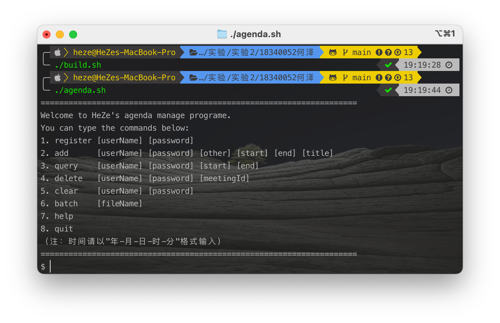

- 注册

    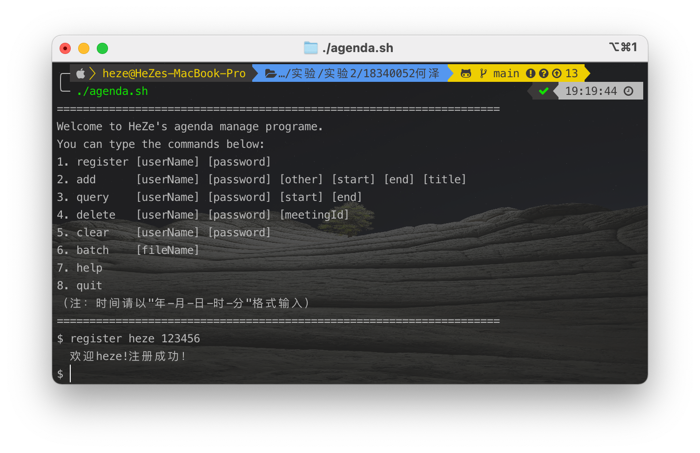

- 添加日程

    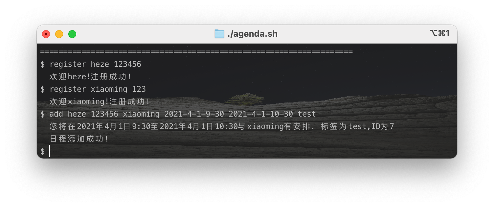

- 查询日程

    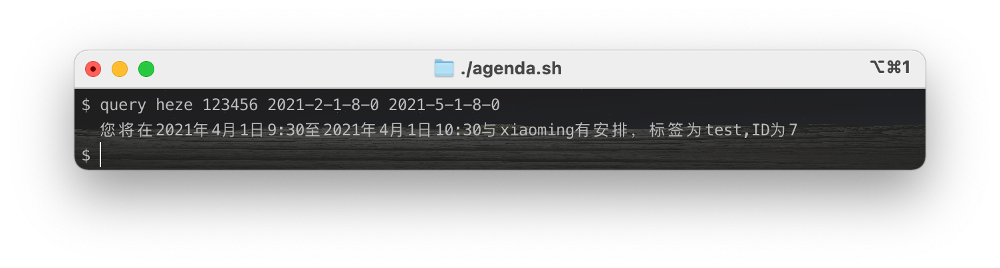

    **（更多的例子详见下面的文件测例）**

## 五、文件多命令测例

只需要输入`batch 文件目录/文件名`即可，我在主目录中提供了两个测例，分别是`test1.txt`以及`错误测试.txt`，其中前者是正常的测试程序功能的测例，后者为输入一些错误的信息可以看到程序的异常处理即测试程序的健壮性。想要运行需要在程序中输入：

```sh
batch ../test1.txt
batch ../错误测试.txt
```

可以看到如下结果：

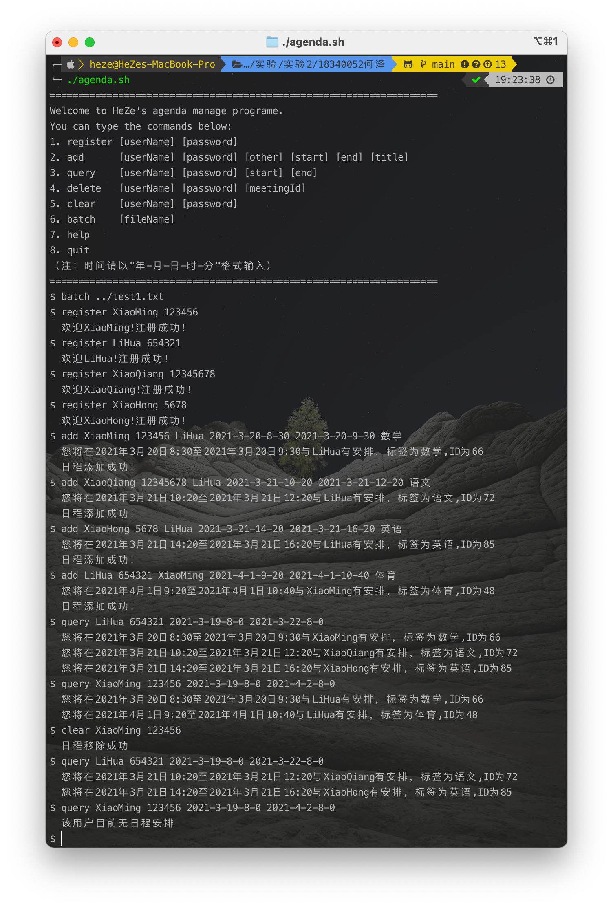

可以看到上面的测例中不包含删除某一日程，这是因为实验要求根据ID删除日程，但是日程ID是随机的，故无法提前写入测例，只能手动输入（接着上面输入）：

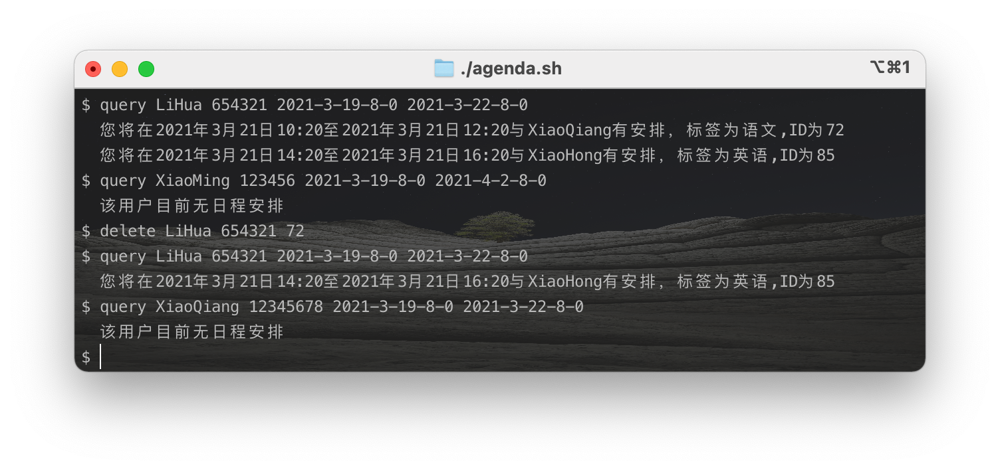

**可以看到实现的所有的功能都是正确的**

## 六、异常处理（即程序健壮性测试）

（下面的输入都是接着上面test1.txt之后输入的）

- 用户名错误

    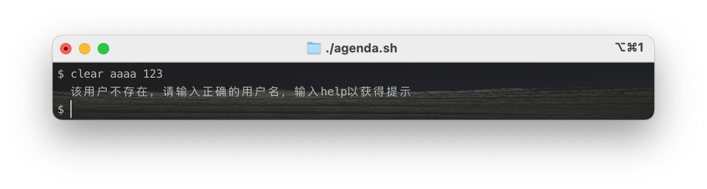

- 密码错误

    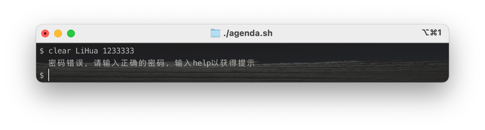

- 想要添加的日程与已有日程冲突

    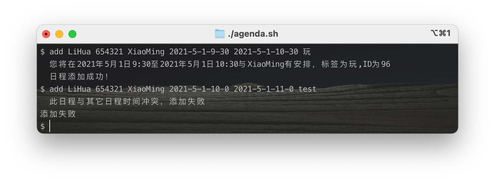

- 当然，为了测试健壮性我也写成了一个测例，即上面的`错误测试.txt`

    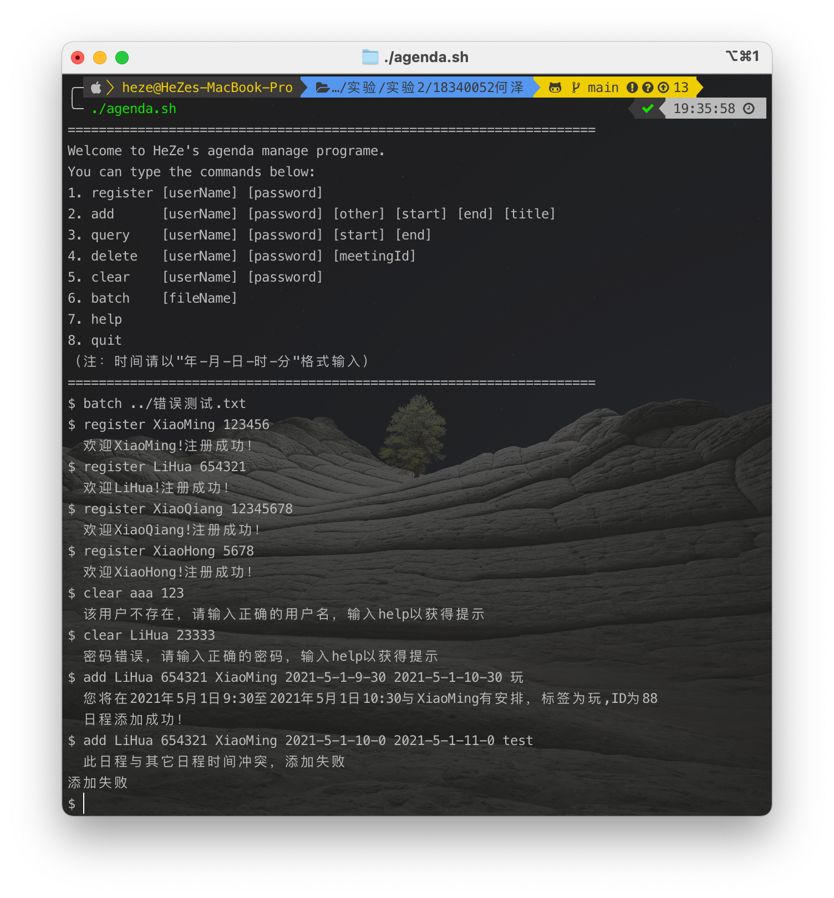


**从以上结果可以看出程序功能完善，且具有一定的健壮性。**

